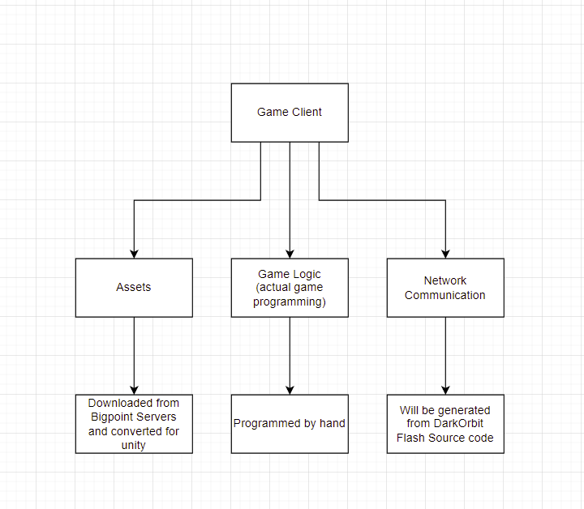

# Project Open Orbit

Welcome to Open Orbit.
We are an organization which aims to create an open source implementation of the DarkOrbit game by Bigpoint.

<b style="color:yellow">Please note: We do not provide any official assets or copyrighted material.</b>

## DISCLAIMER

<b style="color:red">
The project is still in an early state and documentation is lacking severely. This will change in the future as things become clearer.
</b>  

## What are you doing exactly?

At the moment, we aim to program a game client, which is compatible with the official servers as well as private servers.
The client will be 3D.

This is a small overview of the plans for the client:

## Assets

We will use official assets, but never provide them here.
There will be toolchains which can download and convert all necessary assets automatically, so that we can avoid copyright infringement.

The long term goal is to create our own assets which are not copyright strikeable.

## Copyright

No copyrighted material will be provided here.

## "But the packets are encrypted?!"

Using several tools, the protocol can be dissected, thus enabling us to generate the necessary netcode.
We are already working on a pipeline that can accomplish this.

## "But BigPoint is already working on a Unity Client?"

Yes, but apparently they don't deliver what was promised - at least as of today (June 30th, 2022).

Also, writing a game client is a fun challenge and the final result would be an open source piece of software that many can enjoy and change to their liking.

## Progress

We are at the beginning.

Much work is currently done in toolchain development in order to speed up future development tasks.
